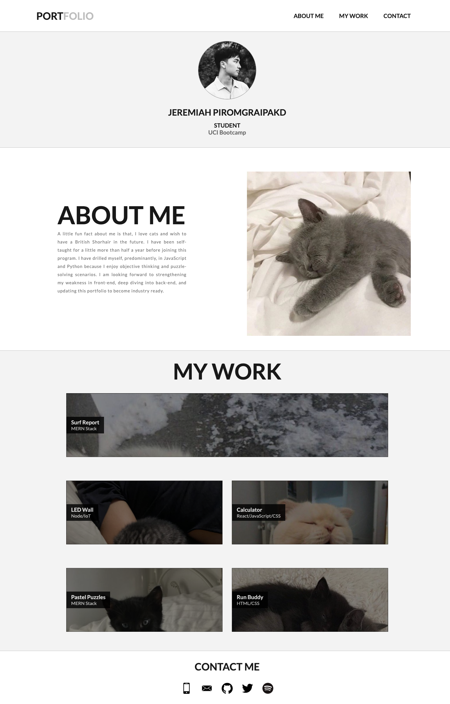

# HTML-CSS-Portfolio

## Description

My primary goals in mind when constructing my portfolio was to learn more in-depth CSS skills, practice formatting optimal code, and strengthening my knowledge in flexbox (as that's my weakpoint with CSS). During development, I learned a lot about media queries and was able to utilize useful CSS techniques like using root variables.

## Installation

N/A

## Usage
To access the deployed page, press the following link: [HERE](https://cytoplasma.github.io/HTML-CSS-portfolio/) To refer to the documentation, open the Chrome DevTools by pressing Command+Option+I(macOS) or Control+Shift+I(Windows)

## License

Please refer to the LICENSE in the repo.